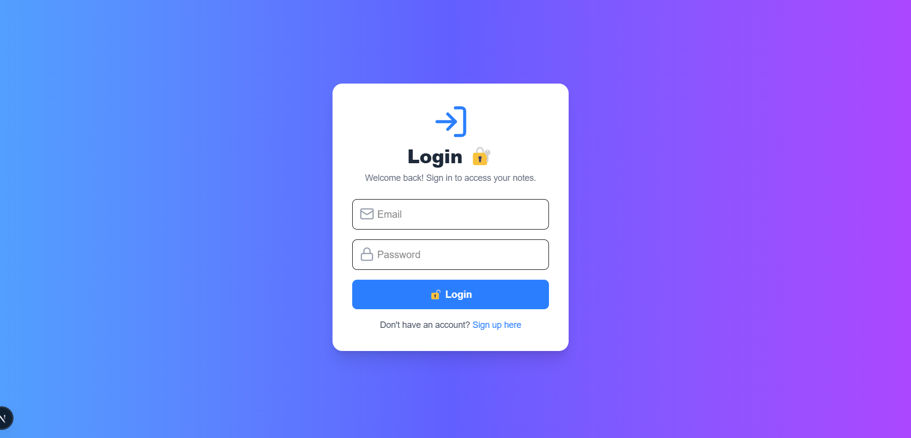

# 📝 Notes Application - Frontend (Next.js + Tailwind + Framer Motion)

Welcome to the **Notes Application** frontend! This is a modern note-taking app built with **Next.js**, **Tailwind CSS**, and **Framer Motion** for animations.

---

## 📜 **Project Overview**

- **User Authentication** (Signup & Login)
- **Create, Update, and View Notes**
- **Beautiful UI with Tailwind & Animations**
- **Card-based Note Display**
- **Floating Button to Add New Notes**

---

## 🛠️ **Requirements**

Ensure you have the following installed:

- **Node.js** (v18+)
- **npm** or **yarn**

---

## ⚙️ **Installation & Setup**

### 1️⃣ Clone the Repository

```bash
git clone https://github.com/ARUN-AK5011/NoteClient.git
cd notes-app/client
```

### 2️⃣ Install Dependencies

```bash
npm install
```

### 3️⃣ Start the Development Server

```bash
npm run dev
```

### 4️⃣ ScreenShots

### **Login Page**



### **Signup Page**


### **Home Page**


